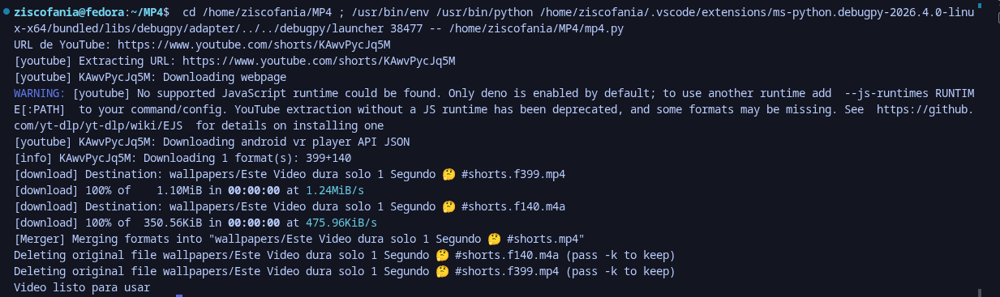

# 🎬 Convertidor MP4

Convertidor de videos de YouTube a MP4 para evitar el uso de sitios externos o no seguros.  
Este script en Python permite descargar videos y guardarlos automáticamente en la carpeta **wallpapers**.

> Si la carpeta no existe, el programa la crea automáticamente.

---

##  Vista de la terminal

  

---

##  Archivos generados

El código crea una carpeta llamada **wallpapers**, donde se almacenan los videos descargados.

  

